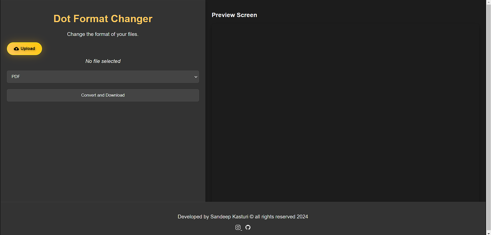

Certainly! Below is a basic `README.md` file template for your project:

---

# Dot Format Changer

Dot Format Changer is a web application that allows users to upload files and convert them to different formats. It provides a simple interface for selecting formats and converting files seamlessly.

## Features

- **File Upload**: Upload various file types for conversion.
- **Format Selection**: Choose from a list of supported formats for conversion.
- **Custom Format Input**: Optionally input a custom file extension for conversion.
- **Conversion and Download**: Convert uploaded files to the selected format and download the converted file.
- **Responsive Design**: Works well on desktop and mobile browsers.

## Technologies Used

- HTML
- CSS
- JavaScript

## Setup Instructions

1. Clone the repository: `git clone https://github.com/sandeepkasturi/Dot-Converter.git`
2. Navigate into the project directory.
3. Open `index.html` in your web browser.

## Usage

1. Click on the "Upload" button to select a file from your device.
2. Choose a format from the dropdown list or enter a custom format.
3. Click on "Convert and Download" to convert the file.
4. Follow the prompts to download the converted file.

## Contributing

Contributions are welcome! Fork the repository and create a pull request with your improvements.

## License

This project is licensed under the MIT License - see the [LICENSE](LICENSE) file for details.

---

### Notes:

- Replace `preview.png` with an actual screenshot or preview image of your web application.
- Customize the setup instructions and usage guidelines based on your specific implementation.
- Update the license information as appropriate for your project.

This `README.md` file provides a brief overview of your project, its features, setup instructions, usage guidelines, and information for contributors. Adjust it further to include any additional details or sections relevant to your specific project needs.
